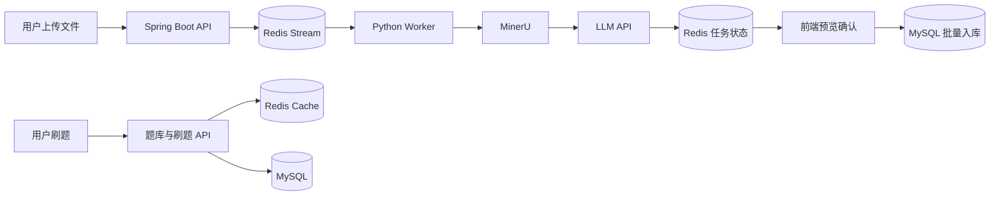
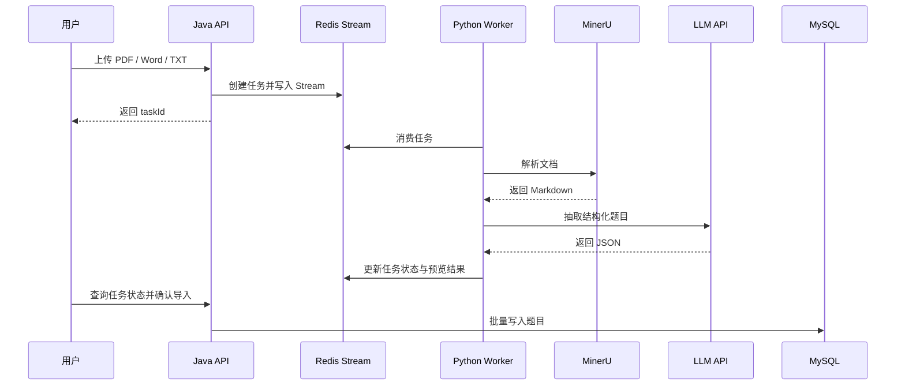
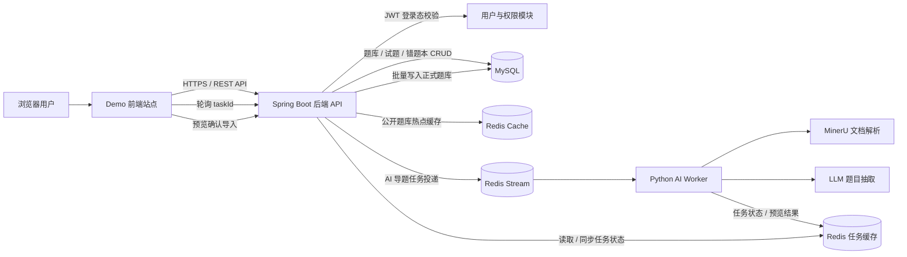

# iShua - 智能在线题库与刷题平台

iShua 是一个面向大学生复习场景的在线题库与刷题平台。项目使用 Spring Boot 提供题库、刷题和错题本等核心能力，并通过 Redis Stream 解耦 Java API 与 Python Worker，接入 MinerU 和 LLM API，实现 PDF、Word、TXT 文档的异步解析、结构化题目抽取、预览确认和批量入库。

> 在线 Demo：https://ishua.heycloudream.cn
> 演示视频：待补充
> 后端代码：当前仓库
> 核心技术：Java 17、Spring Boot、MySQL、Redis、Redis Stream、Python、MinerU、LLM API

## 核心亮点

### 1. 多模态文档智能导题

用户上传 PDF、Word 或 TXT 文件后，Java API 创建导入任务并写入 Redis Stream。Python Worker 消费任务，调用 MinerU 将非结构化文档解析为 Markdown，再通过 LLM API 将内容抽取为标准化题目数据。解析结果不会直接落库，而是先进入预览确认流程，降低异常格式影响正式题库的风险。

### 2. Redis Stream 异步任务解耦

文档解析和 LLM 调用属于长耗时任务。项目将 Java API 与 Python Worker 解耦：HTTP 请求仅负责校验文件、创建任务和异步派发，前端通过任务状态接口轮询处理进度，避免第三方调用阻塞请求线程。

### 3. Redis 热点题库缓存

针对公开题库的高频读取场景，使用 Redis 缓存题库详情和试题列表，并采用 Cache-Aside 模式维护缓存一致性：查询时优先读取缓存，数据更新后主动删除缓存，降低重复查询 MySQL 的开销。

### 4. 刷题与错题本闭环

平台支持题库分页、随机刷题、服务端判分、错题自动归档、错题移除和错题重刷。刷题列表默认不返回答案与解析，用户提交答案后才返回判分结果。

### 5. 权限与数据隔离

基于 JWT、拦截器和用户上下文完成登录态校验，并在题库管理接口中校验资源归属关系，避免用户越权操作其他用户的题库。

## 系统架构



## AI 导题流程



## Demo 全栈架构



Demo 中，前端只与 Spring Boot 后端通过 REST API 通信。普通题库、刷题和错题本请求由后端直接访问 MySQL，并对公开热点题库使用 Redis 缓存；AI 导题请求则先由后端创建任务并写入 Redis Stream，再由 Python Worker 异步完成 MinerU 解析和 LLM 抽题。前端通过 taskId 轮询任务状态，拿到预览题目后确认导入，后端再将题目批量写入正式题库。

## 关键代码导航

| 能力               | 代码位置                               |
| ---------------- | ---------------------------------- |
| AI 导题任务派发与状态管理   | `src/main/java/.../service/ai/`    |
| Python AI Worker | `ai-import-worker/`                |
| JWT 与用户上下文       | `src/main/java/.../util/`          |
| 题库访问校验           | `src/main/java/.../service/guard/` |
| Redis 缓存逻辑       | `src/main/java/.../service/impl/`  |
| 数据库初始化脚本         | `sql/schema/`                      |
| 测试代码             | `src/test/`                        |

## 快速启动

```bash
git clone https://github.com/C1ouDreamW/atlas.git
cd atlas
mvn clean test
mvn spring-boot:run
```

完整环境变量、MySQL 初始化方式和 Python Worker 启动说明见：

* `docs/DEPLOYMENT.md`
* `docs/API.md`
* `docs/AI_IMPORT_FLOW.md`
* `docs/TESTING.md`
