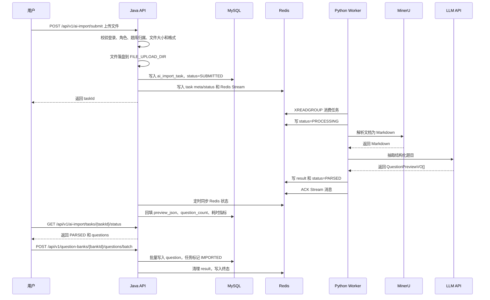
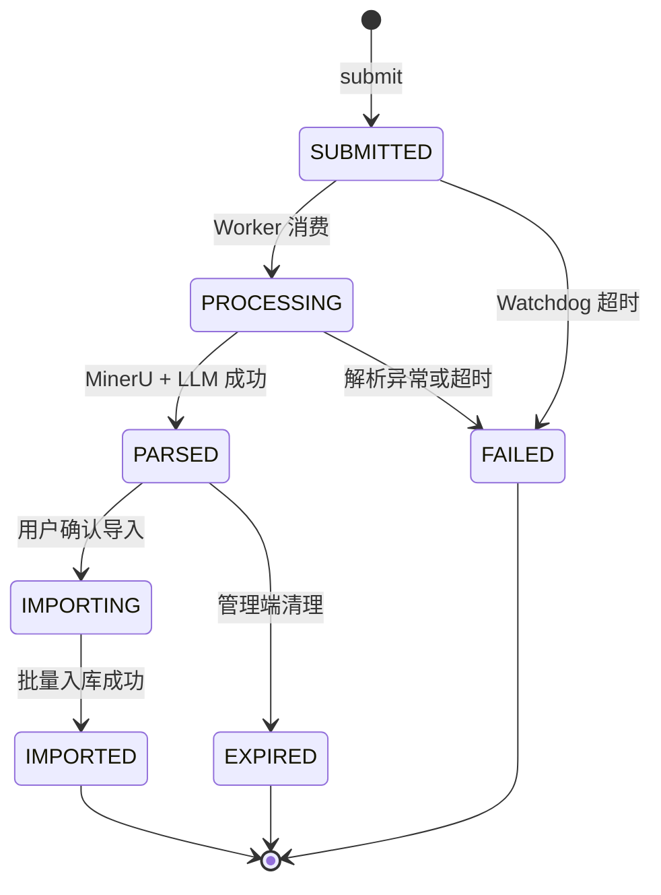

# AI 智能导题流程

iShua 的 AI 导题流程用于把 PDF、Word、TXT 文档异步解析为结构化题目。核心设计是：HTTP 请求只负责提交任务，耗时的文档解析和 LLM 抽题由 Python Worker 处理，解析结果先进入预览确认，再批量写入正式题库。

## 参与组件

| 组件 | 职责 |
| --- | --- |
| 前端 | 上传文件、轮询任务状态、展示预览、确认导入 |
| Spring Boot API | 校验权限、保存文件、创建任务、写入 Redis Stream、提供状态查询和批量入库接口 |
| Redis Stream | 解耦 Java API 与 Python Worker |
| Python Worker | 消费任务，调用 MinerU 和 LLM，写回状态与预览结果 |
| MinerU | 将 PDF/Word/TXT 等文档解析为 Markdown |
| LLM API | 从 Markdown 抽取标准化题目 JSON |
| MySQL | 持久化任务、题库、试题和错题数据 |
| Redis | 存放任务热状态、预览结果、幂等锁和热点题库缓存 |

## 主流程



## 状态机



状态说明：

| 状态 | 说明 |
| --- | --- |
| `SUBMITTED` | Java API 已创建任务并投递 Stream |
| `PROCESSING` | Worker 正在处理 |
| `PARSED` | 已生成预览题目，等待用户确认 |
| `IMPORTING` | 正在导入正式题库 |
| `IMPORTED` | 已导入完成 |
| `FAILED` | 解析失败或任务超时 |
| `EXPIRED` | 预览结果长时间未确认，被管理端清理 |

## 关键接口

### 1. 提交导入任务

```http
POST /api/v1/ai-import/submit
Content-Type: multipart/form-data
Authorization: Bearer <token>
```

表单字段：

| 字段 | 必填 | 说明 |
| --- | --- | --- |
| `file` | 是 | `.txt`、`.pdf`、`.docx`，最大 10MB |
| `bankId` | 是 | 目标题库 ID |

权限：

- 最低角色：`PREMIUM`
- 题库必须属于当前用户，`ADMIN` 可绕过归属校验。
- 默认每用户每小时最多 5 次，可通过 `AI_IMPORT_RATE_LIMIT_PER_HOUR` 调整。

成功响应中的 `data.taskId` 用于后续轮询和确认导入。

### 2. 查询任务列表

```http
GET /api/v1/ai-import/tasks?current=1&pageSize=10&status=PARSED,PROCESSING,SUBMITTED
Authorization: Bearer <token>
```

用途：

- 页面刷新后恢复进行中的任务。
- 找回已经解析但尚未确认导入的任务。
- 可设置 `includePreview=true` 携带预览题目，建议小分页使用。

### 3. 轮询任务状态

```http
GET /api/v1/ai-import/tasks/{taskId}/status
Authorization: Bearer <token>
```

前端建议：

- `SUBMITTED`、`PROCESSING`：每 2-5 秒轮询。
- `PARSED`：停止轮询，展示预览确认页。
- `IMPORTED`、`FAILED`、`EXPIRED`：停止轮询并展示结果。

当任务不存在或已彻底过期时，接口可能返回 `code=200` 且 `data=null`。

### 4. 确认批量导入

```http
POST /api/v1/question-banks/{bankId}/questions/batch
Content-Type: application/json
Authorization: Bearer <token>
```

请求体：

```json
{
  "taskId": "a1b2c3d4e5f67890abcdef1234567890",
  "questions": [
    {
      "questionType": "SINGLE",
      "stem": "TCP 属于哪一层协议？",
      "options": ["应用层", "传输层", "网络层", "数据链路层"],
      "answer": ["B"],
      "analysis": "TCP 是传输层协议。"
    }
  ]
}
```

服务端落库数据来源优先级：

1. MySQL `ai_import_task.preview_json`
2. Redis `ishua:task:result:{taskId}`
3. 请求体 `questions`

接口具备幂等保护：

- 已经 `IMPORTED` 的任务再次提交会返回成功。
- 并发导入同一任务会返回 `409`。
- `EXPIRED` 或非 `PARSED` 状态不能导入。

## Redis Stream 消息

Java API 将任务元数据序列化后写入：

- Stream：`ishua:task:stream`
- Consumer group：`ishua-ai-workers`
- 字段：`payload`

Worker 会兼容两种消息格式：

- `payload` 为 JSON 字符串。
- Redis fields 本身就是任务字段。

任务中必须包含：

| 字段 | 说明 |
| --- | --- |
| `taskId` | 业务任务 ID |
| `fileUrl` | `file://...` 文件路径 |
| `bankId` | 目标题库 |
| `userId` | 提交用户 |
| `fileName` | 原始文件名 |
| `fileType` | 文件扩展名或类型 |

## Redis Key

| Key | TTL | 说明 |
| --- | --- | --- |
| `ishua:task:meta:{taskId}` | 1 小时 | 任务元数据 |
| `ishua:task:status:{taskId}` | 1 小时 | 任务状态 |
| `ishua:task:result:{taskId}` | 30 分钟 | 预览题目结果 |
| `ishua:task:import_lock:{taskId}` | 5 分钟 | 批量入库锁 |
| `ishua:task:watchdog:lock` | 短 TTL | Watchdog 扫描锁 |

`ai_import_task` 表是任务可恢复的权威来源。Redis 是热路径缓存，Java 定时任务会把 Worker 写入 Redis 的状态同步回 MySQL。

## Worker 处理步骤

Worker 主循环：

1. 校验 `MINERU_TOKEN` 和 `LLM_API_KEY`。
2. 确保 Redis Stream 消费组存在。
3. 使用 `XREADGROUP` 读取一条任务。
4. 写入 `PROCESSING` 状态。
5. 调用 MinerU，将上传文件解析为 Markdown。
6. 调用 LLM，将 Markdown 抽取为 `QuestionPreviewVO[]`。
7. 写入 `ishua:task:result:{taskId}` 和 `PARSED` 状态。
8. ACK 当前 Stream 消息。
9. 失败时写入 `FAILED` 状态并 ACK，避免同一坏任务反复阻塞。

Worker 对终态有保护：如果 Java 已经把任务标记为 `IMPORTED`，或 Watchdog 已经标记为 `FAILED`，Worker 不会再覆盖终态。

## 文件存储

Java API 负责保存上传文件，生成 `file://` 路径。Worker 通过该路径读取文件。

部署要求：

- `FILE_UPLOAD_DIR` 使用稳定的绝对路径。
- Java API 与 Worker 必须能访问同一个目录。
- Worker 所在机器如果与 Java 不同，需要通过共享存储或对象存储适配解决，目前默认实现是本地文件路径。

## 预览题目结构

`QuestionPreviewVO`：

| 字段 | 类型 | 说明 |
| --- | --- | --- |
| `questionType` | string | `SINGLE`、`MULTI`、`JUDGE`、`SHORT_ANSWER` |
| `stem` | string | 题干 |
| `options` | string[] | 选项列表，简答题通常为空数组 |
| `answer` | string[] | 正确答案 |
| `analysis` | string | 解析 |

确认导入后会转换为正式 `question` 表记录，其中 `options` 和 `answer` 会转成 `options_json`、`answer_json`。

## 异常与恢复

常见异常：

| 场景 | 结果 | 处理建议 |
| --- | --- | --- |
| 文件格式或大小不合法 | `400` | 仅上传 `.txt`、`.pdf`、`.docx`，最大 10MB |
| 用户角色不足 | `403` | 将用户升级为 `PREMIUM` 或使用 `ADMIN` |
| 限流 | `429` | 等待下一个时间窗口或调整限流配置 |
| MinerU/LLM 失败 | `FAILED` | 查看 Worker 日志和调试产物 |
| 长任务超时 | `FAILED` | 调大 `AI_IMPORT_TASK_TIMEOUT_MS` 和 MinerU 轮询超时 |
| 预览长期未导入 | `EXPIRED` | 重新上传，或管理端延后清理策略 |

管理端可通过：

- `GET /api/v1/admin/ai-import/stats` 查看近 N 天任务统计。
- `POST /api/v1/admin/ai-import/tasks/cleanup` 清理长时间未确认导入的 `PARSED` 任务。

## 联调建议

- 先启动 MySQL、Redis、Java API，再启动 Worker。
- 先用 Swagger 登录并拿到 JWT。
- 使用 PREMIUM 或 ADMIN 账号创建题库。
- 上传小型 `.txt` 文件验证完整链路。
- 如只验证 Worker 主循环，可设置 `SKIP_LLM=true`，但此时不会产出真实题目。
- 设置 `DEBUG_MODE=true` 可保存 MinerU Markdown 和 LLM 调试产物，便于排查抽题质量。
